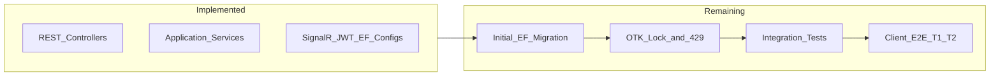

# Gdot Chat Server — Continuation Plan

## Current state vs original plan

The [original backend spec](.cursor/plans/gdotchat_server_backend_2dbb2d0c.plan.md) defined 8 todos. Here is an honest assessment against the codebase under [`server/`](server/):

| Original todo | Status | Notes |
|---|---|---|
| server-scaffold | **Done** | [`GdotChat.slnx`](server/GdotChat.slnx), 5 projects, [`docker-compose.yml`](server/docker-compose.yml), full [`Program.cs`](server/GdotChat.Api/Program.cs) pipeline |
| domain-ef | **Blocked** | All 6 entities, exceptions, Fluent configs, [`AppDbContext`](server/GdotChat.Infrastructure/Persistence/AppDbContext.cs) exist — **no `Migrations/` folder** |
| jwt-auth | **Code done** | [`AuthService`](server/GdotChat.Application/Services/AuthService.cs), [`JwtTokenService`](server/GdotChat.Infrastructure/Security/JwtTokenService.cs), [`AuthController`](server/GdotChat.Api/Controllers/AuthController.cs) — no tests |
| users-devices | **Code done, 1 gap** | Controllers + [`DeviceService`](server/GdotChat.Application/Services/DeviceService.cs) implemented — missing `FOR UPDATE SKIP LOCKED` on OTK consume |
| message-relay | **Done** | [`MessageRelayService`](server/GdotChat.Application/Services/MessageRelayService.cs), [`MessagesController`](server/GdotChat.Api/Controllers/MessagesController.cs), [`SignalRMessageNotifier`](server/GdotChat.Infrastructure/Notifications/SignalRMessageNotifier.cs), [`MessageRelayHub`](server/GdotChat.Infrastructure/Hubs/MessageRelayHub.cs) |
| purge-worker | **Mostly done** | [`EnvelopePurgeWorker`](server/GdotChat.Infrastructure/Background/EnvelopePurgeWorker.cs), rate limits, [`ExceptionHandlingMiddleware`](server/GdotChat.Api/Middleware/ExceptionHandlingMiddleware.cs) — minor hardening gaps below |
| integration-tests | **Not started** | [`UnitTest1.cs`](server/GdotChat.Tests/UnitTest1.cs) is a placeholder; Testcontainers package already referenced |
| client-wireup | **Not started** | [`docs/PROTOCOL.md`](docs/PROTOCOL.md) not updated; no live T1/T2 run |



---

## Phase A — Make the server runnable (critical path)

### A1. Generate and commit Initial EF migration

[`Program.cs`](server/GdotChat.Api/Program.cs) calls `db.Database.MigrateAsync()` in Development, but with zero migrations this will create an empty schema or fail.

**Action:**
```bash
cd server
docker compose up -d
dotnet ef migrations add Initial -p GdotChat.Infrastructure -s GdotChat.Api
dotnet ef database update -p GdotChat.Infrastructure -s GdotChat.Api
```

**Verify migration includes:**
- All 6 tables with snake_case names (already configured in [`Configurations/`](server/GdotChat.Infrastructure/Persistence/Configurations/))
- Partial index on `one_time_pre_keys (device_id) WHERE is_consumed = false` ([`OneTimePreKeyConfiguration`](server/GdotChat.Infrastructure/Persistence/Configurations/OneTimePreKeyConfiguration.cs))
- Index on `message_envelopes (recipient_device_id, created_at)`
- Unique constraints: `users.username`, `devices (user_id, registration_id)`, pre-key `(device_id, key_id)`

Optional: add `CREATE EXTENSION IF NOT EXISTS pgcrypto` in migration `Up()` if you want UUID defaults at DB level (entities already generate GUIDs in C#).

### A2. Smoke-test the API locally

1. `docker compose up -d` in [`server/`](server/)
2. `dotnet run --project server/GdotChat.Api`
3. Open Swagger at `https://localhost:5067/swagger` ([`launchSettings.json`](server/GdotChat.Api/Properties/launchSettings.json) matches client [`lib/config.ts`](lib/config.ts))
4. Manual curl/Swagger: register → login → search user → fetch prekey bundle → send message → pending → ack

**Expected blockers to watch for:** migration errors, Npgsql connection failures, JWT claim mapping (`sub` / `device_id` — already handled in [`ClaimsPrincipalExtensions`](server/GdotChat.Api/Extensions/ClaimsPrincipalExtensions.cs)).

---

## Phase B — Correctness fixes (spec gaps)

### B1. OTK consume: `FOR UPDATE SKIP LOCKED`

Current code in [`DeviceService.GetPreKeyBundleAsync`](server/GdotChat.Application/Services/DeviceService.cs) uses a transaction but plain LINQ — concurrent bundle requests can double-consume the same OTK.

**Fix:** Replace the OTK fetch with raw SQL inside the existing transaction:

```sql
SELECT id, device_id, key_id, public_key, is_consumed, consumed_at
FROM one_time_pre_keys
WHERE device_id = @deviceId AND is_consumed = false
ORDER BY key_id
LIMIT 1
FOR UPDATE SKIP LOCKED
```

Use `FromSqlRaw` + key lookup, or `ExecuteSqlRaw` + reload. Keep the existing 428 throw when no row is returned.

### B2. Rate limiter returns 429 (not 503)

[`Program.cs`](server/GdotChat.Api/Program.cs) registers policies but does not set rejection status. Per spec §10, clients expect **429**.

**Fix:** In `AddRateLimiter`, add:
```csharp
options.RejectionStatusCode = StatusCodes.Status429TooManyRequests;
```

### B3. Gate CORS to Development only

Currently `UseCors("DevCors")` runs unconditionally with `AllowAnyOrigin`. Wrap in `if (app.Environment.IsDevelopment())` per original spec §14.

---

## Phase C — Integration test suite

Replace placeholder [`UnitTest1.cs`](server/GdotChat.Tests/UnitTest1.cs) with a Testcontainers + WebApplicationFactory harness.

### C1. Shared test fixture

Create `server/GdotChat.Tests/Integration/GdotChatWebApplicationFactory.cs`:
- Spin up `PostgreSqlContainer` (Testcontainers.PostgreSql already in csproj)
- Override `ConnectionStrings:Default` via `ConfigureWebHost`
- Use `WebApplicationFactory<Program>` (partial Program class already declared)

### C2. Test files mapped to spec §16

| File | Tests | Pass criteria |
|---|---|---|
| `AuthFlowTests.cs` | S1: register ×2 distinct userIds; login; refresh rotates token | 201/200, unique IDs, old refresh revoked |
| `PreKeyBundleTests.cs` | S2/T6: bundle consumes OTK; exhaust → 428 | Second fetch decreases count; 101st fetch → 428 |
| `MessageRelayTests.cs` | S3/T1: enqueue → pending → ack | Pending empty after ack; DB row deleted; ciphertext ≠ plaintext |
| `EnvelopePurgeTests.cs` | T7: expired envelope purged | Insert envelope with `ExpiresAt` in past; call `PurgeExpiredAsync`; row gone |

**Helper patterns:**
- Build a valid `RegisterRequest` with fake base64 key material (server stores opaque bytes — no libsignal needed)
- Assert HTTP status codes match [`ExceptionHandlingMiddleware`](server/GdotChat.Api/Middleware/ExceptionHandlingMiddleware.cs) mapping (409, 428, 403, 404, 401)
- Never assert on ciphertext content matching plaintext — only that stored bytes are opaque and relayed unchanged

Run: `dotnet test server/GdotChat.Tests`

---

## Phase D — Client integration (T1/T2)

### D1. Update docs

Extend [`docs/PROTOCOL.md`](docs/PROTOCOL.md) with:
- Dev REST: `https://localhost:5067/v1` (or `http://<LAN-IP>:5066/v1` if using HTTP profile)
- SignalR: `https://localhost:5067/hubs/messages`
- Env var: `EXPO_PUBLIC_API_URL=https://<LAN-IP>:5067/v1` for physical device; `http://10.0.2.2:5066/v1` for Android emulator
- Server startup: `docker compose up -d && dotnet run --project server/GdotChat.Api`

Add a short [`server/README.md`](server/README.md) with the same commands (keeps PROTOCOL.md protocol-focused).

### D2. Manual E2E checklist (T1/T2 from spec §16)

1. Register user A and user B on two devices/emulators
2. A searches B, fetches prekey bundle, sends encrypted message
3. B receives `EnvelopeAvailable` via SignalR ([`lib/api/signalr-client.ts`](lib/api/signalr-client.ts)), pulls pending, decrypts, acks
4. Verify in PostgreSQL: `message_envelopes.ciphertext` is not plaintext; row deleted after ack

**Known client gap (out of server scope but affects T2):** If B gets 428 on bundle fetch, client may need pre-key upload wiring per SQLCipher plan §17 item 4 — note during testing.

---

## Phase E — Repo hygiene (quick wins)

- Add root [`.gitignore`](.gitignore) entries for `server/**/bin/`, `server/**/obj/` (currently untracked build artifacts pollute git status)
- Mark original plan todos complete once Phases A–D pass
- Optional: add `/health` endpoint for docker/orchestrator probes (was optional in original spec)

---

## Recommended execution order

1. **A1 + A2** — unblock running server (highest priority)
2. **B1–B3** — small targeted fixes before writing tests
3. **C1 + C2** — automated regression suite
4. **D1 + D2** — prove full stack with Expo client
5. **E** — gitignore + doc polish

## Files most likely touched

| Phase | Files |
|---|---|
| A | New `server/GdotChat.Infrastructure/Persistence/Migrations/*` |
| B | [`DeviceService.cs`](server/GdotChat.Application/Services/DeviceService.cs), [`Program.cs`](server/GdotChat.Api/Program.cs) |
| C | New `server/GdotChat.Tests/Integration/*.cs`; delete/replace [`UnitTest1.cs`](server/GdotChat.Tests/UnitTest1.cs) |
| D | [`docs/PROTOCOL.md`](docs/PROTOCOL.md), new [`server/README.md`](server/README.md) |
| E | [`.gitignore`](.gitignore) |

## Definition of done

- `dotnet run` applies migrations and serves all 11 REST endpoints + SignalR hub
- `dotnet test` passes S1–S3, T6, T7 integration tests
- Two Expo clients exchange a message through the live relay (T2)
- Original plan todos 1–7 marked complete; todo 8 (client-wireup) verified manually
